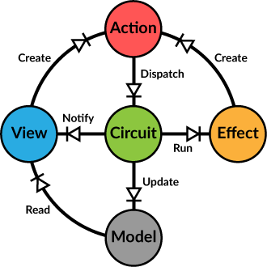

# 

> /ˈdʌɪəʊd/
>
> a semiconductor device with two terminals, typically allowing the flow of current in one direction only

[](https://gitter.im/ochrons/diode)
[](https://travis-ci.org/ochrons/diode)
[](https://www.scala-js.org)

Diode is a Scala/Scala.js library for managing immutable application state with unidirectional data flow. It is heavily
influenced and inspired by [Flux](https://facebook.github.io/flux/) and
[Elm](https://github.com/evancz/elm-architecture-tutorial/) architectures, and libraries like
[Om](https://github.com/omcljs/om) and [Redux](https://github.com/rackt/redux). Diode helps you build applications that
are easy to reason about, have predictable behaviour, are easy to test and debug and are type safe. It's a compact, high
performing and extensible library with no external dependencies.

## Documentation

Full documentation [available here](https://diode.suzaku.io).

## Getting Started

Add following dependency declaration to your Scala project.

<pre><code class="lang-scala">"io.suzaku" %% "diode" % "1.1.1"</code></pre>

In a Scala.js project the dependency looks like this.

<pre><code class="lang-scala">"io.suzaku" %%% "diode" % "1.1.1"</code></pre>



### The Model

Core of an application using Diode is the immutable application _model_, typically represented as a hierarchy of case
classes, storing the application's state. In our super simple example app the model contains a single value, the
`counter`.

```scala
case class RootModel(counter: Int)
```

Since having a static counter is not very interesting, we'll want to have some way to change it. In Diode all changes to
the application model happen through _actions_. Let's define a couple of useful actions:

```scala
case class Increase(amount: Int) extends Action
case class Decrease(amount: Int) extends Action
case object Reset extends Action
```

Actions in Diode can be anything (that extends `diode.Action` trait or provides an `ActionType[A]` type class instance), but typically
case classes work best due to their pattern matching capability.

### The Circuit

Application state is stored in a `Circuit[M]` which also takes care of all of the action handling. In your application
you'd typically define a singleton object extending the Circuit. Your only responsibilities are to define the
`initialModel` and `actionHandler` methods, everything else is taken care by Diode's Circuit.
 
```scala
object AppCircuit extends Circuit[RootModel] {
  def initialModel = RootModel(0)
  override val actionHandler: HandlerFunction =
    (model, action) => action match {
      case Increase(a) => Some(ModelUpdate(model.copy(counter = model.counter + a)))
      case Decrease(a) => Some(ModelUpdate(model.copy(counter = model.counter - a)))
      case Reset => Some(ModelUpdate(model.copy(counter = 0)))
      case _ => None
    }
  }
```

The `actionHandler` is a function receiving the current model and action and returning a result of type
`Option[ActionResult[M]]`. Each action must return a new copy of the (root)model so we use the convenient case
class `copy` function. Note that we are _not updating_ the `model` variable here, just returning a copy. The actual
update is performed by the Circuit.

Because we want to keep the code clean and DRY, let's use the `ActionHandler` helper class to define our actions
instead.

```scala
val counterHandler = new ActionHandler(zoomTo(_.counter)) {
  override def handle = {
    case Increase(a) => updated(value + a)
    case Decrease(a) => updated(value - a)
    case Reset => updated(0)
  }
}
val actionHandler = composeHandlers(counterHandler)
```

Note how in the `ActionHandler`'s constructor we _zoom_ into the model, defining a reader/writer pair to access the
part of the model these actions are interested in. This defines a _scope_ for our handler, both preventing it from
inadvertently accessing other parts of our application model and also simplifying access to the part we _are_ interested
in (provided through the `value` function). The class also provides helper functions like `updated`, making it trivial
to perform model updates in our code.

Finally we convert the `ActionHandler` into a handler function with `composeHandlers`. As its name implies, you can
supply several handlers that are composed together to form a single handler function taking care of all your actions.

### The View

To show our model to the user and to allow some interaction with it, we need a view. In this example we'll be building
it using Scalatags, but typically you would be using some framework like React instead (for which diode-react provides
convenient integration).

```scala
class CounterView(counter: ModelR[Int], dispatch: Dispatcher) {
  def render = {
    div(
      h3("Counter"),
      p("Value = ", b(counter.value)),
      button(onclick := { () => dispatch(Increase(2)) }, "Increase"),
      button(onclick := { () => dispatch(Decrease(1)) }, "Decrease"),
      button(onclick := { () => dispatch(Reset) }, "Reset")
    )
  }
}
```

The view receives a _model reader_ to access the part of the model we are interested in and a `Dispatcher` to dispatch
actions. Because we use a model reader instead of a direct counter value, we don't need to create a new instance of the
view when the counter changes. The reader always returns an up-to-date value. If we had a more complex model, the reader
would also allow us to zoom further into the model, to provide subviews only a partial model.

For interaction we define three buttons for increasing, decreasing and resetting the counter. Clicking one of the
buttons dispatches an appropriate action, to be handled by the `counterHandler` we defined before.

In our main class we create an instance of the `CounterView`, granting it read-only access to the `counter` value in our
model.

```scala
val counter = new CounterView(AppCircuit.zoom(_.counter), AppCircuit)
```

### The Listener

Our application now has a model, it can change the model through actions and view the model in HTML. What is still
missing is informing the view about changes to the model so that it knows when to redraw itself. For this the Circuit
provides a subscription model, informing registered listeners whenever the model is updated.

```scala
val root = document.getElementById("root")
AppCircuit.subscribe(() => render(root))
AppCircuit(Reset)

def render(root: Element) = {
  val e = div(
    h1("Diode example"),
    counter.render
  ).render
  root.innerHTML = ""
  root.appendChild(e)
}
```

After subscribing to model updates we start the circuit by dispatching a `Reset` action. This will cause the model to
update and the `render` to be called. Further updates due to user clicking the buttons are handled similarly.

# Examples

There are several example projects in the [examples](examples) directory.

First one is a [simple](examples/simple) application showing the basic use of Diode.

The second example features a recursive [tree view](examples/treeview) component with a couple of edit actions. Both
examples use "plain HTML" without any framework like React.

The third example is the traditional [TodoMVC](examples/todomvc) implemented with React on Diode. This example also
demonstrates the use of Diode Dev Tools.

The [RAF example](examples/raf) demonstrates the use of _action processors_ to batch and render synchronized animations
with `requestAnimationFrame`.

A more complete application example is the [Scala.js SPA tutorial](https://github.com/ochrons/scalajs-spa-tutorial),
demonstrating the use of React integration features and async operations.

# Change history

See separate [changes document](CHANGES.md)

# Contributors

Diode was created and is maintained by [Otto Chrons](https://github.com/ochrons) - otto@chrons.me - Twitter:
[@ochrons](https://twitter.com/ochrons).

Contributors: @PerWiklander, @DylanArnold

## MIT License

Copyright (c) 2015-2016, Otto Chrons (otto@chrons.me)

Permission is hereby granted, free of charge, to any person obtaining a copy of this software and associated
documentation files (the "Software"), to deal in the Software without restriction, including without limitation the
rights to use, copy, modify, merge, publish, distribute, sublicense, and/or sell copies of the Software, and to permit
persons to whom the Software is furnished to do so, subject to the following conditions:

The above copyright notice and this permission notice shall be included in all copies or substantial portions of the
Software.

THE SOFTWARE IS PROVIDED "AS IS", WITHOUT WARRANTY OF ANY KIND, EXPRESS OR IMPLIED, INCLUDING BUT NOT LIMITED TO THE
WARRANTIES OF MERCHANTABILITY, FITNESS FOR A PARTICULAR PURPOSE AND NONINFRINGEMENT. IN NO EVENT SHALL THE AUTHORS OR
COPYRIGHT HOLDERS BE LIABLE FOR ANY CLAIM, DAMAGES OR OTHER LIABILITY, WHETHER IN AN ACTION OF CONTRACT, TORT OR
OTHERWISE, ARISING FROM, OUT OF OR IN CONNECTION WITH THE SOFTWARE OR THE USE OR OTHER DEALINGS IN THE SOFTWARE.
