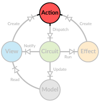

# Actions


Actions hold information on how to update the model and they are the _only_ way to make these updates. Basically the current model is a result of all previous
actions, much like in [event sourcing](http://martinfowler.com/eaaDev/EventSourcing.html).

In Diode actions can be anything (extending `AnyRef`) but typically case classes are used for easy pattern matching.
 
## Designing Actions
 
Actions are very much application specific but can generally be classified into _global_ and _targeted_ actions. A global action is something like the examples
below, always changing the same part of the model.

```scala
case class Increase(amount: Int)
case class Decrease(amount: Int)
case object Reset
```

Targeted actions, on the other hand, can change different parts of the model depending on the value of the action. For example if your data is in a tree, you
would need to know what part of the tree should be changed. One option is to have unique IDs for data and search for the ID in the action handler, but typically
it's more efficient and easier to use a _path_ to the data.

```scala
// path is defined by a sequence of identifiers
case class AddNode(path: Seq[String], node: FileNode)
case class RemoveNode(path: Seq[String])
case class ReplaceNode(path: Seq[String], node: FileNode)
case class Select(selected: Seq[String])
```

If you need an action to update multiple independent parts of your model, it's usually better to break it down into several consecutive actions. This way each
action handler can focus on its own part of the model and the logic is kept simple and easy to reason about. Actions are processed in the order they are
dispatched, so you can be sure your sequence of actions are processed in correct order.

