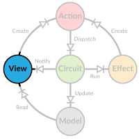

# Views



In Diode a _view_ is a component that renders data from a model and reacts to model updates. It doesn't necessarily have
to be a visual component (although it typically is); you could also make one to automatically store changed model data
into local storage.

## Building a View

A simple view needs only a _reader_ to access model data, and a _dispatcher_ to dispatch actions.

```scala
class CounterView(counter: ModelRO[Int], dispatch: Dispatcher) {
  def render = {
    div(
      h3("Counter"),
      p("Value = ", b(counter.value)),
      button(onclick := { () => dispatch(Increase(2)) }, "Increase"),
      button(onclick := { () => dispatch(Decrease(1)) }, "Decrease"),
      button(onclick := { () => dispatch(Reset) }, "Reset")
    )
  }
}
```

Using a `ModelR` instead of the actual value means we don't have to recreate the view every time the model is updated.
We can create the view once in the beginning and use it forever.
  
```scala
val counter = new CounterView(AppCircuit.zoom(_.counter), AppCircuit)
```

For our directory tree we need a more complex view that supports the recursive nature of the data.

```scala
class TreeView(root: ModelRO[FileNode], parent: Seq[String], 
               selection: Seq[String], dispatcher: Dispatcher) {
  val id = root.value.id
  val path = parent :+ id
  val childSeq = build

  // recursively build the tree view
  def build = {
    root.value.children.zipWithIndex.map { case (c, idx) =>
      new TreeView(root.zoom(_.children(idx)), path, selection, dispatcher)
    }
  }
  ...
```

When creating a `TreeView`, it recursively creates a hierarchy of `TreeView` components in the `build` method. Each view
gets its own reader and an updated path to indicate its relative position in the tree.

```scala
  ...
  def render: Frag = {
    val isSelected = if(selection.nonEmpty && selection.last == id) "active" else ""

    def renderName(name: String) =
      a(href := "#", cls := isSelected, onclick := {() => dispatcher(Select(path))}, name)

    root.value match {
      case Directory(id, name, children) =>
        li(cls := s"directory", renderName(name),
          ul(childSeq.map(_.render))
        )
      case File(id, name) =>
        li(cls := s"file", renderName(name))
    }
  }
}
```

In the render method the name of the node is rendered as a clickable element that dispatches a `Select` action when
clicked. Currently selected node is highlighted. If the node is a directory, its children are recursively rendered.

## Listening to Changes

Views should update when the model changes. To get notified, subscribe to changes using
`Circuit.subscribe(cursor)(listener)`. The call returns an unsubscribing function you can later call to stop receiving
notifications.

```scala
val root = dom.document.getElementById("root")
val unsubscribe = AppCircuit.subscribe(AppCircuit.zoom(_.tree))(tree => render(root, tree))
def render(root: dom.Element, tree: ModelRO[Tree]) = { ... }
```

Listeners are called when the model pointed by the cursor changes, even if it would have no effect in the part of the
model your view is interested in. Therefore it makes sense to check if a real change has happened, before doing
expensive re-computations.

```scala
// rebuild the tree view if the model has changed
val dirRoot: ModelRO[FileNode] = tree.zoom(_.root)
if (dirRoot =!= currentModel) {
  currentModel = dirRoot.value
  treeView = new TreeView(dirRoot, Seq.empty, tree.zoom(_.selected), AppCircuit)
}
```

If only `selected` is changed, we don't need to rebuild the tree as its structure has stayed the same. We do, however,
need to re-render the tree to reflect this change.

Quite often you need to listen to changes in a component that doesn't need to know about the application model or its Circuit.
In these cases you can use currying to pass a function that already contains the cursor to your model. To make this more convenient,
Diode defines a `Subscriber[A]` type which is an alias for `(ModelRO[A] => Unit) => () => Unit`. For example:

```scala
class MyComponent(subscriber: Subscriber[Tree]) {
  val unsubscribe = subscriber(myListener) 
  def myListener(tree: ModelRO[Tree]) = { ... }
}

val component = new MyComponent(AppCircuit.subscribe(AppCircuit.zoom(_.tree)))
```